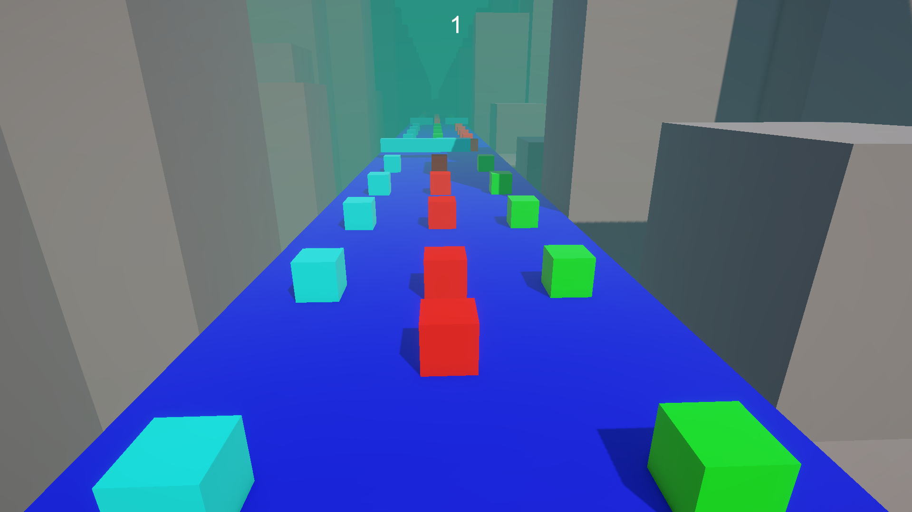

# 🏃‍♂️ Cube Runner 🚀  
A fast-paced endless runner built with Unity! Control a cube, dodge obstacles, and test your reflexes as you speed through an ever-changing track. Developed as a learning project to explore Unity game development. 🎮  

## 📌 Table of Contents   
- [🎯 Game Objective](#-game-objective)  
- [🎮 Features](#-features)  
- [📸 Screenshots](#-screenshots)  
- [🛠️ Technologies Used](#-technologies-used)  
- [🚀 How to Play](#-how-to-play)  
- [🎮 Controls](#-controls)  
- [📥 Installation](#-installation)  
- [💡 Development Insights](#-development-insights)  
- [🤝 Contributing](#-contributing)  
- [📜 License](#-license)  

## 🎯 Game Objective  
Your goal is simple: **Dodge obstacles and survive as long as possible!**  
The longer you last, the higher your score. Can you set a new record? 🚀  

## 🎮 Features  
✅ Simple yet addictive gameplay  
✅ Increasing difficulty for a real challenge  
✅ Minimalist design with smooth controls  
✅ Built using Unity  


## 📸 Screenshots  
 

## 🛠️ Technologies Used  
- Unity (Game Engine)  
- C# (Scripting)  

## 🚀 How to Play  
1. Run the game.  
2. ## 🎮 Controls  
- Move Left: **A** / Left Arrow  
- Move Right: **D** / Right Arrow  
3. Avoid obstacles and survive as long as possible!

## 📥 Installation  
1. Clone the repository:  
   ```bash
   git clone https://github.com/yourusername/cube-runner.git
2. Open the project in Unity.
3. Press Play and start running!

## 💡 Development Insights  
Cube Runner was built as a learning project to explore Unity’s game mechanics,  
including physics, collision detection, and endless level generation.  

## 🤝 Contributing
Feel free to fork the repo, submit issues, or contribute improvements!

## 📜 License
This project is open-source and available under the Apache 2.0 License.
